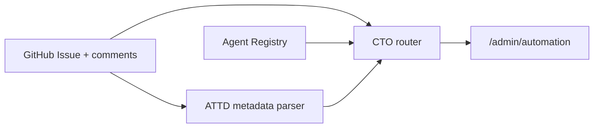

# ATTD Agent OS — Phase G1 foundation

Phase G1 adds a **code-only Agent Registry**, conservative GitHub issue metadata parsing, a pure **CTO routing layer**, and read-only **Agent OS** surfaces on `/admin/automation`. It reuses the existing F1/F2 software factory (GitHub issues, BUILD_APPROVED gate, orchestrator queue, automation dashboard) without database migrations or business-logic changes.

Related docs:

- `docs/github-task-status.md` (F1a task status)
- `docs/github-build-orchestrator.md` (F1b orchestrator)
- `docs/github-automation-dashboard.md` (F2 dashboard)
- `AGENTS.md` (engineering and safety rules)

## Architecture (G1)



- **Source of truth:** GitHub issues remain the engineering task system in G1.
- **No writes:** The router does not post comments, labels, or spawn external processes.
- **No secrets:** Agent contracts never store model credentials or tokens.

## Agent Registry

Server-side typed contracts live in `src/features/agent-os/agent-registry.ts` for:

| Agent ID | Role |
| --- | --- |
| `ATTD_CTO` | Orchestrator / routing authority |
| `CRM_AGENT` | CRM & lead/sales |
| `PRICING_QUOTATION_AGENT` | Quotation workflows (Pricing Engine reuse) |
| `PUBLIC_WEBSITE_AGENT` | Public site & admin mobile UX |
| `SEO_AGENT` | Marketing / content / SEO |
| `QA_AGENT` | Tests & CI verification |
| `DEPLOYMENT_AGENT` | Preview / release checklists (no auto deploy) |
| `RELIABILITY_AGENT` | Stability & incident support |

Each contract defines: id, display name, role, mission, allowed task areas, capabilities, forbidden scopes, escalation rules, default priority, and active flag.

## Issue metadata convention

Backward-compatible markers in the **issue body** and/or **comments** (later lines override earlier ones):

```text
ATTD_AGENT: PUBLIC_WEBSITE_AGENT
ATTD_AREA: PUBLIC_UI
ATTD_PRIORITY: P1
ATTD_PARENT_TASK: #123
```

- Issues **without** these markers behave as before (routing uses TASK_AREA comments, risk labels, and conservative keyword fallback).
- `TASK_AREA:` comments continue to drive lane board classification (`docs/github-automation-dashboard.md`).
- Invalid `ATTD_AGENT` values are ignored (no throw); routing falls through.

## Routing precedence

Implemented in `src/features/agent-os/agent-router.ts`:

1. **High-risk escalation** → `ATTD_CTO` with human escalation (`risk:high` label and/or conservative high-risk domain keywords). Overrides invalid or valid `ATTD_AGENT` when risk applies.
2. **Valid `ATTD_AGENT` override** when the agent is active.
3. **Task area** — canonical lane mapping from TASK_AREA / `ATTD_AREA` context.
4. **Keyword fallback** on title/body/comments (last resort).
5. **Default** → `ATTD_CTO`.

High-risk domains align with `AGENTS.md` (pricing, payment, banking, auth, permissions, invoices, accounting, destructive migrations, etc.).

## Dashboard integration

`/admin/automation` (F2) now also shows:

- Assigned agent per task (with escalation hint when required)
- Display task area (`ATTD_AREA` when set, else TASK_AREA)
- Priority and parent task when metadata is present
- Agent summary cards: open-task counts per agent (active / blocked / queued)

Authorization, GitHub read tokens, and caching behavior are unchanged. No client-side token exposure.

## Safety boundaries (G1)

- Preserves **one active Builder** queue and **BUILD_APPROVED** authorization.
- No automatic merge, deploy, or agent-spawned shell processes.
- No Prisma schema changes or production database writes from Agent OS code paths.
- Does not modify pricing, payment, banking, auth, or permission **business logic**.

## Future phases

- **G2:** Persistent `AgentRun` / `TaskRun` / event state (deliberate Prisma migration review).
- **G3:** CTO event loop with safe automatic assignment and guarded actions.
- **G4:** Specialist agents + QA / deployment / reliability closed loop.
