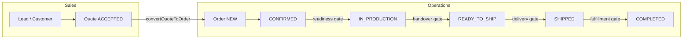

# 1. Current Workflow Map

## End-to-end business flow

Parallel execution tracks exist **below** order status:

- **Production plan** (`ProductionPlan`) — per order item, pre-start planning
- **Lean Ops timeline** (`ItemProductionTracking`) — item-level stage progress (preferred when initialized)
- **Legacy stages** (`OrderProductionStage`) — per-item shop-floor stages when Lean Ops not initialized
- **Delivery executions** (`OrderDeliveryExecution`) — shipment batches with line-level qty tracking

## Operator journey: quote → order

| Step | Actor | Surface | System action |
|------|-------|---------|---------------|
| 1 | Sales | `/admin/quotes/[id]` | Quote reaches `ACCEPTED` |
| 2 | Sales / Ops | Quote detail → "Tạo đơn hàng" | `POST /api/orders/from-quote/[quoteId]` |
| 3 | System | — | `convertQuoteToOrder()` — idempotent; copies items, variants, cost snapshots, BOM; creates `OrderActivity` |
| 4 | Ops | `/admin/orders/[id]` | Order starts at `NEW`; review workspace tabs |

**Alternate intake paths:**

| Path | Route | Use case |
|------|-------|----------|
| Manual order | `/admin/orders/new` | Full commercial order with customer linkage |
| Quick order | `/admin/orders/new/quick` | Spreadsheet-style bulk entry, Excel import, stock validation |
| CRM handover | Opportunity WON flow | `createOrderDraftFromOpportunity()` → `convertQuoteToOrder()` with relaxed accept gate |

## Operator journey: order → production

| Step | Actor | Surface | System action |
|------|-------|---------|---------------|
| 1 | Ops | Order workspace | Confirm commercial data; assign production/delivery owners |
| 2 | Ops | Status action → `CONFIRMED` | Timestamp `confirmedAt` |
| 3 | Ops | Production pack / files | Upload tech pack, artwork (`OrderProductionFile`) |
| 4 | Ops | Optional: Initialize Lean Ops | `ItemProductionInitModal` → `POST /api/manufacturing/production-items/initialize-from-order` |
| 5 | Ops | Production plan | `/admin/production/plan` — doc/material/QC sub-status per item |
| 6 | Ops | Production approval | Artwork/sample release gates (`OrderItemProductionApproval`) |
| 7 | Ops | Status → `IN_PRODUCTION` | `production-readiness.service` checklist or acknowledge override; may seed legacy stages |
| 8 | Shop floor | Timeline or job detail | Stage/batch updates, issues, QC evidence |
| 9 | Ops | Status → `READY_TO_SHIP` | `handover-readiness.service` checklist or override |

**Navigation overlap (current):**

Operators can reach production work from:

- Order workspace → production execution section
- `/admin/production/plan` (canonical jobs list; `/admin/production/jobs` redirects here)
- `/admin/production/board` (item kanban)
- `/admin/production/orders-board` (order-level board)
- `/admin/manufacturing/production-timeline` (Lean Ops timeline)
- `/admin/operations` (cross-functional dashboard)

## Operator journey: production → delivery

| Step | Actor | Surface | System action |
|------|-------|---------|---------------|
| 1 | Ops | Order workspace → delivery tab | Set method, carrier, recipient, expected date on order header |
| 2 | Ops | Delivery board | `/admin/delivery` — READY_TO_SHIP / SHIPPED filter |
| 3 | Ops | Create delivery execution | `delivery-execution.service` — DRAFT → dispatch flow |
| 4 | Ops | Delivery note | `/admin/orders/[id]/delivery-note?executionId=…` or PDF API |
| 5 | Ops | Status → `SHIPPED` | Delivery fields + execution fulfillment or override |
| 6 | Ops | Status → `COMPLETED` | Fulfillment completeness or override |

## Operator journey: monitoring & alerts

| Signal | Where | Trigger |
|--------|-------|---------|
| Orders list KPIs | `/admin/orders` | `order-list-dashboard.service` |
| Production KPIs | `/admin/production` | `production-plan.service` dashboard |
| Delivery board indicators | `/admin/delivery` | `delivery-execution-board.service` |
| Overdue delivery | Notification center | `deliveryExpectedAt` past due, non-terminal order |
| New orders (24h) | Notification center | Recently created orders |
| Ready for handover | Notification center | WON opportunity without linked order |

## Documents in the workflow

| Document | Route / API | When used |
|----------|-------------|-----------|
| Production sheet | `/admin/orders/[id]/production-sheet` | Pre/during production — variants, BOM, files, readiness |
| Delivery note | Per execution | At dispatch / delivery |

## Workflow boundaries (explicit non-scope)

Phase 1 audit confirms these are **out of lane** per issue guardrails:

- Payment recording and banking reconciliation (order workspace has payment tab but lane does not change payment logic)
- Invoice / accounting posting
- Pricing engine formula changes
- Public customer-facing order tracking
