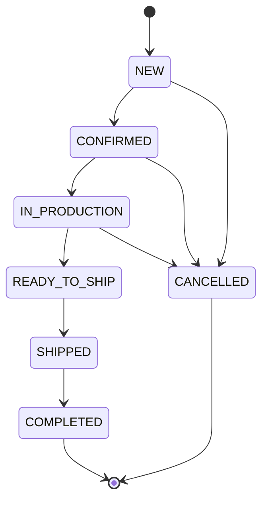
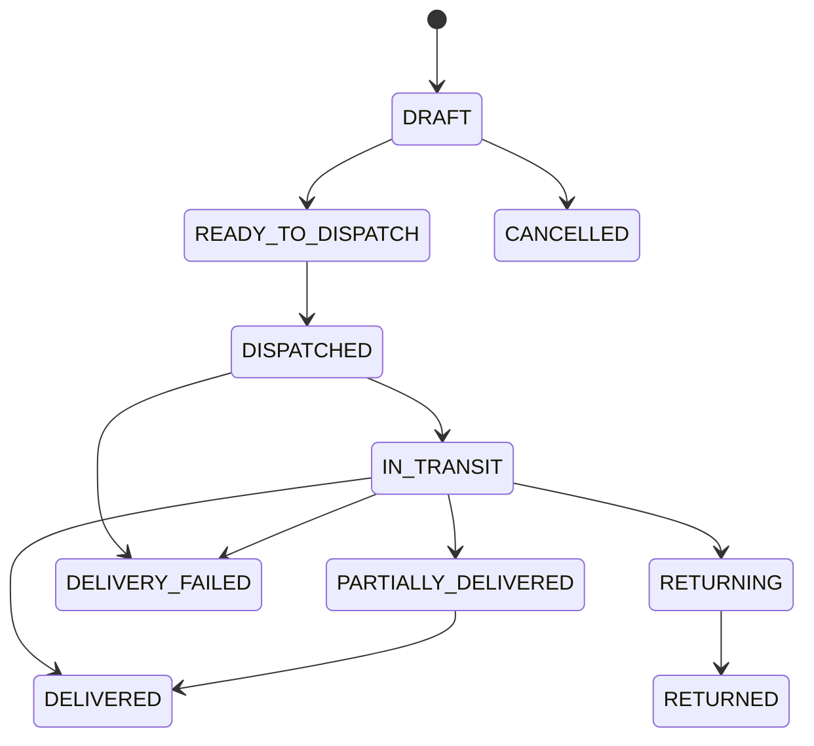

# 4. Status & State Map

## Order status (`OrderStatus`)

**Source:** `src/features/orders/order-status.ts`, `order.service.ts`



### Transition gates

| To status | Gate service | Override |
|-----------|--------------|----------|
| `IN_PRODUCTION` | `production-readiness.service` | Acknowledge + reason (non-legacy) |
| `READY_TO_SHIP` | `handover-readiness.service` | Acknowledge + reason |
| `SHIPPED` | `delivery-fulfillment.service` + delivery fields | Override |
| `COMPLETED` | Fulfillment completeness | Override |
| `CANCELLED` | Cancel reason required | — |

**Corrections:** Step backward among CONFIRMED..SHIPPED with correction reason. COMPLETED and CANCELLED are terminal.

**Timestamps:** `confirmedAt`, `productionStartedAt`, `readyToShipAt`, `shippedAt`, `completedAt`, `cancelledAt`.

**Legacy bypass:** Orders detected as legacy (`isLegacyOrderForReadiness`, `isLegacyOrderForHandover`, `isLegacyOrderForDeliveryExecution`) skip Lean Ops / execution requirements.

## Production plan status (`ProductionPlanStatus`)

**Source:** `src/features/production-planning/production-plan-status.ts`

```
NOT_PLANNED → WAITING_DOCUMENTS → WAITING_MATERIALS → READY_TO_START
  → IN_PROGRESS → WAITING_QC → REWORK → COMPLETED
  (ON_HOLD available)
```

Derived sub-statuses for documents, materials, and QC feed into plan column display.

## Item production status (`ItemProductionStatus`) — Lean Ops

**Source:** `src/features/item-production-tracking/item-production.service.ts`

```
DRAFT → PLANNED → IN_PRODUCTION → FINISHING → COMPLETED
  (ON_HOLD, CANCELLED)
```

Derived automatically from stage progress when Lean Ops tracking exists.

## Item production stage keys (`ItemProductionStageKey`)

Ten-stage Lean Ops sequence (workflow templates vary):

```
MATERIAL_SYNC → … → READY_TO_SHIP
```

Examples: `TEE_PRINT_EMBROIDERY` template in `ItemProductionWorkflowTemplate`.

## Legacy production stage (`ProductionStageType` / `ProductionStageStatus`)

**Stage types:** CUTTING, SEWING, PRINTING, EMBROIDERY, QC, PACKING (representative set in schema).

**Stage status:** NOT_STARTED → IN_PROGRESS → COMPLETED (also BLOCKED, SKIPPED).

Seeded on `IN_PRODUCTION` transition when Lean Ops not initialized.

## Production approval (`OrderItemProductionApproval`)

Release gate before stage progress:

- Artwork / sample approval states
- Bypass audited via `OrderItemProductionApprovalBypass`

## Delivery execution status (`DeliveryExecutionStatus`)

**Source:** `delivery-execution.service.ts`



Line items track planned / dispatched / delivered / returned / damaged quantities per variant.

**Note:** Failure transitions to `DELIVERY_FAILED` are often driven by delivery attempt results (`DeliveryAttemptResult.FAILED`) in `delivery-execution.service.ts`, not only by direct status updates.

## Item production next action (Lean Ops)

**Source:** `ItemProductionTracking` model (`nextAction`, `nextActionDueDate`)

Item-level next action exists in Lean Ops tracking data but is **not aggregated or surfaced** in the order workspace header or summary cards today. Phase 2 OP3/OP7 should roll up item-level signals into an order-level next-action chip rather than duplicating per-item fields.

## Cross-layer sync (current behavior)

| Relationship | Synced? | Notes |
|--------------|---------|-------|
| Order status ↔ Item production status | **No** | Manual order status updates |
| Order status ↔ Production plan status | **No** | Independent per item |
| Order status ↔ Delivery execution | **Partial** | Gates check fulfillment at SHIPPED/COMPLETED only |
| Lean Ops ↔ Legacy stages | **Bridged** | `lean-ops-execution-bridge.ts`; Lean Ops preferred when initialized |
| Order `shippedAt` / `deliveredAt` ↔ Execution DELIVERED | **No** | Order header timestamps are set on admin order status transition to `SHIPPED` (`order.service.ts` sets both if absent); execution `deliveredAt` is set when execution status becomes `DELIVERED` or `PARTIALLY_DELIVERED` (`delivery-execution.service.ts`). No automatic sync between layers. |

## Operator-facing label map

Vietnamese labels centralized in:

- `order-labels.ts` — order status
- Production plan / timeline components — inline labels

Phase 2 should consolidate **business-first** labels (e.g. "Đang sản xuất", "Chờ giao", "Quá hạn") decoupled from internal enum names in operator views.
