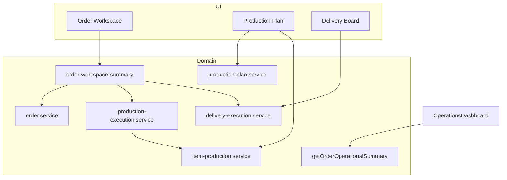

# 7. Recommended Architecture & Primitives

## Design principles

1. **Order workspace as hub** — single place for customer, quote source, items, owners, next action, production summary, delivery summary.
2. **One execution truth** — Lean Ops when initialized; legacy stages read-only for old orders; bridge via existing `production-execution.service.ts`.
3. **Business-first states** — operator sees overdue/blocked/next action, not raw enum names.
4. **Additive evolution** — no parallel order/production models; extend existing services.
5. **Lane boundaries** — pricing, payment, auth changes stay in their lanes.

## Recommended operator primitives

### P1: Per-order workspace summary (consolidation, not greenfield)

**Existing global summary (do not rename or replace):**

- `getOrderOperationalSummary()` in `order-operations.service.ts` — aggregates KPIs across **all active orders**
- `GET /api/orders/operations-summary` — consumed by `/admin/operations` (`OperationsDashboard`)

**Proposed per-order primitive (distinct name to avoid collision):**

```
buildOrderWorkspaceSummary(orderId) → {
  orderStatus, customerLabel, quoteLink,
  salesOwner, productionOwner, deliveryOwner,
  promisedDate, isOverdue, blockerCodes[],
  nextAction: { label, href, permission },   // rollup: gates + item-level Lean Ops nextAction
  productionSummary: { planStatus, itemCount, blockedCount },  // extend aggregateProductionSummary
  deliverySummary: { executionStatus, readyQty, pendingQty }
}
```

**Reuse path:** Extend existing workspace helpers (`deriveOrderMilestones`, `aggregateProductionSummary`, `getOrderProductionSummary`, production/delivery readiness services) rather than parallel abstractions.

**Implementation home:** `src/features/orders/order-workspace-summary.service.ts` (Phase 2)  
**Consumers:** `OrderWorkspaceHeader` / summary cards (enhance existing components), orders list row enrichment, notification center.

**Naming rule:** `getOrderOperationalSummary()` = global dashboard scope; `buildOrderWorkspaceSummary(orderId)` = single-order workspace scope.

### P2: Next-action resolver

Deterministic priority queue:

1. Missing required fields for current status
2. Pending production approval
3. Readiness/handover gate failures
4. Overdue date
5. Default: "No action required"

**No new models** — reads readiness/handover/fulfillment/approval services.

### P3: Canonical navigation map

| Intent | Canonical route | Deprecate (soft) |
|--------|-----------------|------------------|
| Find any order | `/admin/orders` | — |
| Operate one order | `/admin/orders/[id]` | — |
| Production job list | `/admin/production/plan` | `/admin/production/jobs` (already redirects) |
| Shop floor timeline | `/admin/manufacturing/production-timeline` | — |
| Order-level production queue | `/admin/production/orders-board` | Merge into plan filters (Phase 2+) |
| Item kanban | `/admin/production/board` | Keep for supervisor role |
| Delivery queue | `/admin/delivery` | — |
| Cross-lane overview | `/admin/operations` | Enhance tiles, don't duplicate boards |

### P4: Handoff events (audit-only, Phase 2+)

Optional structured `OrderActivity` metadata:

```typescript
type HandoffEvent = {
  kind: "QUOTE_CONVERTED" | "PRODUCTION_INITIALIZED" | "READY_TO_SHIP" | "DISPATCHED";
  actorId?: string;
  reason?: string;
  gateSnapshot?: Record<string, boolean>;
};
```

Additive — no migration required if stored in existing `detail` JSON first.

## Layer diagram (target steady state)



## Anti-patterns to avoid

| Anti-pattern | Why |
|--------------|-----|
| New `OperationalOrder` model | Duplicates `Order` |
| Parallel pricing on order lines | Must use Pricing Engine |
| Silent auto status changes | Breaks audit expectations; use suggestions |
| Fourth production board | Increases navigation debt |
| Mobile-only duplicate forms | Conflicts with Mobile UX lane |

## Integration with other lanes

| Lane | Integration point |
|------|-------------------|
| CRM | Lead/customer on order; opportunity handover; activity cross-links |
| Quotation | Quote→order conversion; accepted quote gate |
| Mobile UX | Shared bottom sheets, sticky headers, touch lists |
| Commercial / costing | Actual cost tab read-only in OP lane changes |
| Manufacturing | Tech pack, workflow templates — consume, don't fork |
