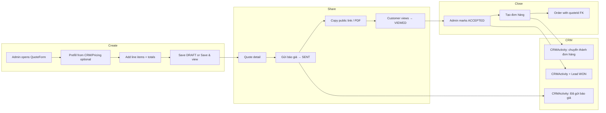
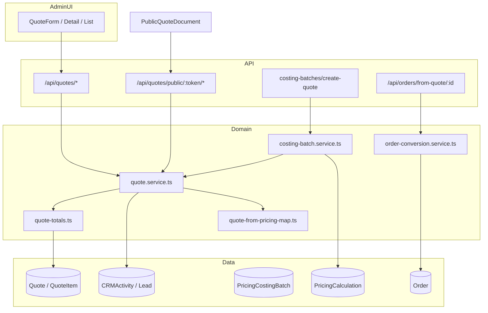

# Quotation Phase Q1: Quote Builder & Workflow Audit

**Issue:** [#101](https://github.com/hoangthang1209-byte/attd.vn/issues/101)  
**Lane:** Quotation / Quote Builder  
**Date:** 2026-09-22  
**Risk level:** Low (analysis-only; no production behavior changes)  
**Schema label in codebase:** Sprint 26.2.0 — Quotation Builder MVP

---

## Executive summary

The ATTD quotation system is a **mature MVP** with substantial functionality already in production. The domain layer (`quote.service.ts`, `quote-totals.ts`, `quote-from-pricing-map.ts`) is well-separated from admin UI and public document rendering. Quotes integrate with CRM (lead/customer/contact snapshots + activity logging), Pricing Engine (single calc, costing calculator, costing batch), and Order conversion.

**Highest-value improvements** for Quote Builder V2 (Q2) are UX and workflow polish—not a rebuild:

1. **Form decomposition** — break the ~1000-line `QuoteForm` into focused sections with clearer hierarchy.
2. **Searchable product/variant picker** — replace capped `<select>` lists (200 products, no search).
3. **Unified send workflow** — preview → copy link / PDF → mark SENT → CRM activity in one guided flow.
4. **List pipeline upgrades** — pagination, sort, owner/customer filters, expiring-soon view.
5. **Sales rep FK fix** — `QuoteForm` stores `Employee.id` but schema FK expects `SalesRepresentative.id`.

**Do not rebuild** existing models, pricing formulas, permission model, or CRM/Order domains. Future pricing-formula or permission-model changes require explicit `HIGH_RISK_APPROVED`.

---

## 1. Current workflow map

### 1.1 Quote lifecycle (status)

```mermaid
stateDiagram-v2
  [*] --> DRAFT
  DRAFT --> SENT: Admin "Gửi báo giá"
  SENT --> VIEWED: Customer opens public link
  SENT --> ACCEPTED: Admin marks accepted
  SENT --> REJECTED: Admin marks rejected
  VIEWED --> ACCEPTED: Admin marks accepted
  VIEWED --> REJECTED: Admin marks rejected
  DRAFT --> CANCELLED: Admin cancels
  SENT --> CANCELLED
  VIEWED --> CANCELLED
  ACCEPTED --> CANCELLED
  REJECTED --> CANCELLED
  note right of EXPIRED: Manual only;\nno auto-expiry job
```

**Statuses:** `DRAFT`, `SENT`, `VIEWED`, `ACCEPTED`, `REJECTED`, `EXPIRED`, `CANCELLED` (`prisma/schema.prisma`).

### 1.2 Creation entry points

| Entry | Route / trigger | Source type |
|-------|-----------------|-------------|
| Manual blank | `/admin/quotes/new` | `MANUAL` |
| From lead | `/admin/quotes/new?leadId=` | Prefill → often `LEAD` |
| From customer | `/admin/quotes/new?customerId=` | Prefill → often `CUSTOMER` |
| From pricing calc | `/admin/quotes/new?pricingCalculationId=` | `PRICING_CALCULATION` |
| Costing calculator | `mode: createQuote` on save | `PRICING_CALCULATION` |
| Costing batch | `/api/pricing/costing-batches/[id]/create-quote` | `PRICING_CALCULATION` |
| Duplicate | POST `/api/quotes/[id]/duplicate` | Inherits source |
| CRM embed | Lead/customer detail → "Tạo báo giá" | Prefill |

### 1.3 End-to-end flow (happy path)



### 1.4 Public delivery path

1. Short URL format: `/{quoteNo}-{publicShortCode}` (e.g. `BG-000001-AB12`) — middleware rewrites to `/quote-link/[quoteLink]`.
2. Page resolves token, client fetches `/api/quotes/public/[token]`.
3. First fetch when status is `SENT` → auto `VIEWED` + `viewedAt`.
4. PDF: admin `/api/quotes/[id]/pdf`; public `/api/quotes/public/[token]/pdf`; print via `/q/[token]/document?mode=print`.

---

## 2. Existing capability inventory

### 2.1 Admin pages

| Capability | Location | Notes |
|------------|----------|-------|
| Quote list | `src/app/(backend)/admin/quotes/page.tsx` → `QuoteListManager` | Search + status filter; 100-row cap |
| Create quote | `src/app/(backend)/admin/quotes/new/page.tsx` → `QuoteForm` | Query-param prefill |
| Edit quote | `src/app/(backend)/admin/quotes/[id]/edit/page.tsx` | Financial lock after send |
| Quote detail | `src/app/(backend)/admin/quotes/[id]/page.tsx` → `QuoteDetailView` | Status actions, PDF, convert |
| Layout guard | `src/app/(backend)/admin/quotes/layout.tsx` | `requireFinancialAdminPage` |

### 2.2 Domain & API

| Layer | Key modules |
|-------|---------------|
| Service | `src/features/quotes/quote.service.ts` — CRUD, status, duplicate, prefill, public |
| Totals | `src/features/quotes/quote-totals.ts` — line + header computation |
| Pricing map | `src/features/quotes/quote-from-pricing-map.ts` — calc → quote items; confidentiality filter |
| Document | `src/features/quotes/quote-document.ts` — admin/public/PDF DTOs |
| Public link | `src/features/quotes/quote-public-link.service.ts`, `quote-public-link.shared.ts` |
| PDF | `src/features/quotes/pdf/*` — Chromium + jsPDF fallback |
| Order handoff | `src/features/orders/order-conversion.service.ts` |

**API routes (no server actions):**

| Route | Methods | Permission |
|-------|---------|------------|
| `/api/quotes` | GET, POST | `quotes.view` / `commercial/create` |
| `/api/quotes/prefill` | GET | `quotes.view` |
| `/api/quotes/[id]` | GET, PATCH | `quotes.view` / `commercial/update` |
| `/api/quotes/[id]/status` | POST | `commercial/update` |
| `/api/quotes/[id]/duplicate` | POST | `commercial/create` |
| `/api/quotes/[id]/pdf` | GET | `commercial/export` |
| `/api/quotes/public/[token]` | GET | Public token + data minimization |
| `/api/quotes/public/[token]/pdf` | GET | Public token + data minimization |
| `/api/pricing/costing-batches/[id]/create-quote` | POST | `commercial/create` |
| `/api/orders/from-quote/[quoteId]` | POST | `commercial/create` |

### 2.3 Data model (preserved — do not rebuild)

**Quote** (`prisma/schema.prisma`): commercial header, party snapshots, public tokens, costing batch link, manual overrides, timestamps (`sentAt`, `viewedAt`, `acceptedAt`, etc.).

**QuoteItem**: product/variant snapshots, pricing linkage (`pricingCalculationItemId`), cost/margin fields, design media, sample/production lead times.

**Enums:** `QuoteStatus`, `QuoteSourceType`, `QuotePriceVatType` (`EXCLUDING_VAT` | `INCLUDING_VAT`).

**Related:** `SalesOpportunity.quoteId` (optional FK — not wired in quote create flow), `Order.quoteId` (1:1 conversion).

### 2.4 Features confirmed present (issue checklist)

| Feature | Status |
|---------|--------|
| Admin list/create/edit/detail | ✅ |
| Duplicate quote | ✅ |
| Status lifecycle | ✅ |
| Lead/Customer/Contact linkage | ✅ |
| Sales rep snapshots | ✅ (with FK bug — see gaps) |
| Multi-item quotes | ✅ |
| Product/Variant selection | ✅ (basic selects) |
| MOQ/SKU/color/category/gender snapshots | ✅ |
| Quantity/unit price, fees, discount, shipping, VAT | ✅ |
| Manual price override (line + total) | ✅ |
| Sample fee/lead time, production lead time | ✅ |
| Design image | ✅ |
| Customer/internal notes, terms | ✅ |
| VND/USD, price VAT type label | ✅ |
| Public quote link | ✅ |
| PDF render/download | ✅ |
| Sent/viewed/accepted/rejected timestamps | ✅ |
| Pricing Calculation integration | ✅ |
| Quote → Order conversion | ✅ |
| CRM activity on create/send/accept/reject/cancel | ✅ |
| Financial lock after send | ✅ (`order-quoted-cost.ts`) |
| Costing batch revision quotes | ✅ |

### 2.5 Tests covering quote behavior

- `quote-from-pricing-confidentiality.test.ts`
- `quote-batch-render.test.ts`, `quote-pdf-me-cleanup.test.ts`
- `costing-batch-quote-revision.test.ts`
- `quoted-cost-continuity.test.ts`
- `quote-pdf-unicode.test.ts`

---

## 3. UX / architecture gaps (by audit scope)

### 3.1 Quote creation UX (`QuoteForm`)

**Files:** `QuoteForm.tsx` (~1000 lines), `QuoteItemFormRow.tsx`, `QuoteTotalsSummary.tsx`, `CustomerSearchField.tsx`, `QuickAddContactModal.tsx`

| Gap | Severity | Detail |
|-----|----------|--------|
| Single long scroll form | P1 | No wizard/sections; high cognitive load for new users |
| Lead picker is flat `<select>` | P1 | Loads all leads via `/api/crm/leads` — no search/pagination |
| No line-item reorder UI | P2 | `sortOrder` exists in schema; no drag-and-drop |
| Edit UI partial lock feedback | P2 | Server blocks financial edits after SENT; UI only warns for ACCEPTED/REJECTED |
| `priceGroupId` not in form | P2 | Model supports it; not exposed in builder |
| Sales rep FK mismatch | **P0** | Form sets `salesRepresentativeId` to `Employee.id`; schema FK is `SalesRepresentative.id`. OrderForm uses `resolveSalesEmployeeSnapshot()` — QuoteForm does not |
| Manufacturing evidence picker unwired | P2 | `QuoteManufacturingEvidencePicker` exists; not on detail/form |

**Positive patterns to preserve:** snapshot decoupling from CRM, live totals via `computeQuoteFromItems`, responsive CSS (`.quote-form__*` in `globals.css`), default terms from `DEFAULT_QUOTE_TERMS`, draft vs save-and-view modes.

**Recommendation:** Decompose into section components (Settings, Party, Lines, Commercial, Notes) without changing save API contract. Fix sales rep resolution in Q2.

### 3.2 Product / variant selection

**Files:** `QuoteItemFormRow.tsx`, `QuoteForm.tsx` (`loadProductMeta`, `loadVariants`), `/api/admin/products`

| Gap | Severity | Detail |
|-----|----------|--------|
| 200-product cap | P1 | `pageSize=200` bootstrap; large catalogs truncated |
| Plain `<select>` pickers | P1 | No searchable picker (unlike `CustomerSearchField`) |
| No live Pricing Engine on manual lines | P2 | Expected for MVP; manual unit price entry only |
| `designMediaAssetId` not set from picker | P2 | Only `designImageUrl` updated |
| No product thumbnails | P3 | Name-only options |

**Future canonical picker pattern (Q3 — recommendation only):**

- Reuse `CustomerSearchField` combobox pattern: async search, debounced API, selected chip + snapshot fields.
- Endpoint: extend `/api/admin/products` with `search`, cursor pagination, optional category filter.
- Variant step: secondary async fetch on product select (existing cache pattern in `variantsMap`).
- Do **not** introduce parallel catalog architecture or new product models in Q3.

### 3.3 CRM integration

**Files:** `quote.service.ts` (`logQuoteActivity`), `quote-party-utils.ts`, `CrmRelatedQuotes.tsx`, CRM detail views

| Gap | Severity | Detail |
|-----|----------|--------|
| No CRM activity on VIEWED | P1 | Public view updates status but sales not notified |
| `SalesOpportunity` not linked on create | P1 | Model has `quoteId`; quote flow never creates/updates opportunities |
| Lead select doesn't sync customer in-form | P2 | Prefill from `?leadId=` sets customer; manual lead dropdown does not |
| Snapshot drift without diff warning | P2 | User can edit snapshots away from live CRM |
| Sales ownership not tied to opportunity pipeline | P2 | `preparedBy` / sales rep separate from opportunity `assignedTo` |

**Positive patterns:** Contact validation (`validateContactBelongsToCustomer`), lead status auto-update on SENT→QUOTED and ACCEPTED→WON, CRM embed lists via `CrmRelatedQuotes`.

### 3.4 Pricing dependency

**Files:** `quote.service.ts`, `quote-from-pricing-map.ts`, `quote-totals.ts`, `costing-batch.service.ts`, pricing UI entry points

| Boundary | Current behavior |
|----------|------------------|
| Manual quote | `sourceType: MANUAL`; totals via `computeQuoteFromItems` (local, not Pricing Engine) |
| Pricing calc → quote | One-way import; marks calc `USED_FOR_QUOTE`; blocks item reuse unless batch revision |
| Costing batch → quote | Aggregates calcs; fingerprint detects changes; revision allows reuse |
| Overrides | Line `manualUnitPrice`; header `manualTotalAmount` + reasons |
| Financial lock | `assertQuoteFinancialFieldsImmutable` for SENT/VIEWED/ACCEPTED |
| Confidentiality | Internal costing strings stripped in `quote-from-pricing-map.ts` |

| Gap | Severity | Detail |
|-----|----------|--------|
| `INCLUDING_VAT` stored but not calculated differently | **P0 (pricing display)** | `computeQuoteTotals` always adds VAT on taxable base; `priceVatType` is label-only. **Any formula fix = HIGH-RISK** |
| No re-sync from pricing calc after create | P2 | One-way import by design |
| Manual lines don't invoke Pricing Engine | P2 | Document as intentional for Q2; engine integration is future scope |

**High-risk gate markers:** VAT calculation changes, margin/cost formula changes, Pricing Engine invocation changes → require `HIGH_RISK_APPROVED` before implementation.

### 3.5 Quote send / share workflow

**Files:** `QuoteDetailView.tsx`, `quote.service.ts` (`updateQuoteStatus`), public pages

| Gap | Severity | Detail |
|-----|----------|--------|
| Disconnected actions | P1 | Copy link, PDF, and "Gửi báo giá" are separate buttons — no guided flow |
| Messaging mismatch | P2 | UI says "link created when sent" but token/shortCode exist at creation |
| No email integration | P2 | Manual copy/paste only |
| No VIEWED CRM activity | P1 | See §3.3 |
| Status buttons always enabled | P2 | Can mark ACCEPTED without SENT; no workflow guard |
| `EXPIRED` manual only | P1 | No job comparing `validUntil` |
| Draft reachable if token leaked | P2 | Token issued at creation; mitigated by secrecy |

**Recommendation (Q6):** Single "Gửi báo giá" modal: document preview → confirm link/PDF → mark SENT → log activity → show copy actions.

### 3.6 Revision / versioning

**Files:** `duplicateQuote()`, costing batch revision in `costing-batch.service.ts`

| Gap | Severity | Detail |
|-----|----------|--------|
| No `parentQuoteId` / version chain | P1 | Copy-based only; no v1→v2 navigation |
| Duplicate retains `pricingCalculationItemId` | P2 | May conflict with reuse guard outside batch revision |
| No formal revision numbering | P2 | Title suffix "(bản sao)" only |
| List/detail don't show revision history | P2 | Batch workspace shows history; quote UI does not |

**Recommendation (Q7):** Schema addition (`parentQuoteId`, `revisionNumber`) is medium-risk; prefer UX on duplicate + batch fingerprint first. Full revision model needs explicit approval.

### 3.7 Quote list / pipeline

**Files:** `QuoteListManager.tsx`, `listQuotes()` in `quote.service.ts`

| Gap | Severity | Detail |
|-----|----------|--------|
| Table-only; no pipeline/kanban | P1 | Status exists but no board view |
| 100-row cap, no pagination | P1 | Hard server limit |
| Fixed sort (`createdAt desc`) | P1 | No amount/validUntil/status sort |
| Missing filters | P1 | No date range, sourceType, sales rep, expiring soon, owner |
| No bulk actions | P3 | — |
| `title` omitted from list | P2 | — |
| Not integrated with SalesOpportunity | P2 | Separate pipeline subsystem |

### 3.8 Quote → Order handoff

**Files:** `order-conversion.service.ts`, `QuoteDetailView.tsx`, `/api/orders/from-quote/[quoteId]`

| Gap | Severity | Detail |
|-----|----------|--------|
| Convert only from detail when ACCEPTED | P2 | No list shortcut |
| Two-step close (accept then convert) | P2 | By design; could offer optional combined flow |
| No partial conversion | P2 | All items → one order (acceptable) |
| SalesOpportunity WON not updated on convert | P2 | Opportunity module separate |

**Positive patterns:** Idempotent 1:1 via `Order.quoteId`, quoted cost snapshot on items, BOM copy, CRM + order activity logging.

### 3.9 Public quote / PDF

**Files:** `PublicQuoteDocument.tsx`, `QuoteDocument*.tsx`, PDF services, `(document)/q/[token]/document`

| Gap | Severity | Detail |
|-----|----------|--------|
| Public page uses admin button classes | P2 | Visual mismatch on customer-facing surface |
| PDF Chromium dependency | P2 | Fallback quality may differ |
| No customer accept/reject on public page | P2 | Admin marks manually |
| ME picker unwired | P2 | Evidence via service only |
| Revision implications unclear to customer | P2 | Each duplicate gets new quoteNo |

**Positive patterns:** Shared document components (`variant`: screen | pdf | print), public DTO minimization (`assertPublicTokenSafePayload`), noindex metadata, responsive/print CSS.

### 3.10 Permissions / security

**Files:** `middleware.ts`, `requireAdminPermission`, `requireFinancialAdminPage`, `docs/audits/CTO-7C-*`

| Finding | Severity | Detail |
|---------|----------|--------|
| Commercial mutation hardening | ✅ | POST/PATCH use `commercial/create|update|export` |
| ME API older auth pattern | P2 | Cookie admin only; not `requireAdminPermission` |
| No row-level ACL on list | P2 | All `quotes.view` users see all quotes |
| Public token at creation | P2 | Pre-send leak surface if token exposed |
| No rate limiting on public endpoints | P3 | Short code is 4 chars + quoteNo |

**Audit scope constraint:** Do not change permission model in Q1–Q2 without `HIGH_RISK_APPROVED`.

---

## 4. Risk classification

| ID | Item | Risk | Gate |
|----|------|------|------|
| R-P0-1 | Sales rep FK (`Employee.id` vs `SalesRepresentative.id`) | Medium (data integrity) | Standard review |
| R-P0-2 | `INCLUDING_VAT` math not applied | **High (pricing)** | `HIGH_RISK_APPROVED` before any formula change |
| R-P1-1 | Quote form UX / decomposition | Low | — |
| R-P1-2 | Product search picker | Low | — |
| R-P1-3 | List pagination/sort/filters | Low | — |
| R-P1-4 | Unified send workflow | Low | — |
| R-P1-5 | VIEWED CRM activity | Low | — |
| R-P1-6 | Auto-expiry (`validUntil` → EXPIRED) | Low–Medium | Job design review |
| R-P1-7 | Revision schema (`parentQuoteId`) | Medium | Migration plan + review |
| R-P2-1 | SalesOpportunity linkage | Medium (CRM lane) | Coordinate with CRM |
| R-P2-2 | Permission model changes | **High** | `HIGH_RISK_APPROVED` |
| R-P2-3 | Email send integration | Medium | Provider + secrets review |
| R-P2-4 | Customer accept/reject on public page | Medium | Auth/token design |

---

## 5. Quote Builder V2 recommended architecture

### 5.1 Principles

1. **Keep `quote.service.ts` as single write authority** — UI sections call existing REST APIs; no duplicated business logic in components.
2. **Snapshot pattern unchanged** — CRM edits on quote do not write back; add optional "refresh from CRM" action in Q4.
3. **Pricing Engine boundary unchanged in Q2** — import paths stay; no new parallel totals formulas.
4. **Component decomposition without route changes** — same pages, smaller focused components under `src/components/admin/quotes/sections/`.
5. **Shared picker primitive** — extract combobox from `CustomerSearchField` for reuse in product picker (Q3).

### 5.2 Proposed module layout (Q2 target)

```
src/features/quotes/           # Unchanged authority
src/components/admin/quotes/
  sections/
    QuoteFormSettings.tsx      # title, dates, currency, VAT type, source
    QuoteFormParty.tsx         # customer, contact, sales, preparedBy
    QuoteFormLines.tsx         # item list + add/remove
    QuoteFormCommercial.tsx    # discount, shipping, overrides
    QuoteFormNotes.tsx         # terms, notes, sample block
  QuoteForm.tsx                # Orchestrator (~200 lines)
  QuoteSendModal.tsx           # Q6 precursor optional in Q2
  QuoteListManager.tsx         # Enhanced filters (Q2)
```

### 5.3 Integration boundaries (do not cross)

| Lane | Owns | Quote lane reads/writes |
|------|------|-------------------------|
| CRM | Lead, Customer, Contact, CRMActivity | FK + snapshots + activity log only |
| Pricing | PricingCalculation, CostingBatch, Engine | Import via existing services |
| Orders | Order, conversion, quoted cost | `convertQuoteToOrder` only |
| Auth | Permission matrix | Existing guards only |

---

## 6. Prioritized roadmap Q2–Q10

| Phase | Theme | Scope | Risk |
|-------|-------|-------|------|
| **Q2** | Quote Builder V2 | Form decomposition, sales rep FK fix, list pagination/sort/basic filters, improved validation feedback | Low |
| **Q3** | Product/Variant picker | Searchable async picker, variant cascade, 200-cap removal | Low |
| **Q4** | CRM prefill polish | Lead→customer sync, "refresh snapshots", VIEWED activity | Low–Medium |
| **Q5** | Preview-before-send | Inline document preview on detail before SENT | Low |
| **Q6** | Send/share workflow | Unified modal: preview → SENT → copy link/PDF → activity | Low |
| **Q7** | Revision/versioning | `parentQuoteId` + UI chain; formal revision labels | Medium |
| **Q8** | Follow-up / expiry | `validUntil` job, expiring-soon list, reminder hooks | Low–Medium |
| **Q9** | Accepted → Order polish | List convert shortcut, post-convert visibility | Low |
| **Q10** | Templates / presets | Reusable terms, fee presets, quote templates | Low |

**Explicitly deferred (high-risk or cross-lane):**

- VAT/`INCLUDING_VAT` formula correction → Pricing lane + `HIGH_RISK_APPROVED`
- Permission model / row-level ACL → Auth lane + `HIGH_RISK_APPROVED`
- SalesOpportunity auto-link → CRM lane coordination
- Email provider integration → separate infra task

---

## 7. Recommended acceptance criteria for Q2

### Q2: Quote Builder V2

**In scope**

- [ ] `QuoteForm` split into ≥4 section components; orchestrator <250 lines
- [ ] Sales representative selection uses `SalesRepresentative` FK correctly (match OrderForm pattern)
- [ ] Quote list: server pagination (default 25, max 100), sort by `createdAt`, `validUntil`, `totalAmount`, `status`
- [ ] Quote list: filters for status (existing), `sourceType`, expiring within 7 days
- [ ] Improved inline validation errors (field-level, Vietnamese labels)
- [ ] No changes to pricing formulas, permission model, or Prisma schema (unless sales rep fix requires none — FK fix is application-layer only)
- [ ] All existing quote tests pass; add tests for sales rep resolution if fixed

**Out of scope for Q2**

- Product search picker (Q3)
- Send modal / email (Q5–Q6)
- Revision schema (Q7)
- VAT calculation changes
- Public page restyle

**Verification**

- Manual: create manual quote, from lead, from pricing calc; send; view public link; accept; convert to order
- CI: lint (changed files), typecheck, security:public-token, test, build

---

## 8. File / module ownership map

Use this to avoid merge conflicts across lanes.

### 8.1 Quotation lane (primary ownership)

| Path | Role |
|------|------|
| `src/features/quotes/**` | Domain logic, totals, document, PDF, public link |
| `src/components/admin/quotes/**` | Admin quote UI |
| `src/components/quotes/**` | Public/PDF document components |
| `src/app/(backend)/admin/quotes/**` | Admin pages |
| `src/app/(public)/quote-link/**` | Public short-link pages |
| `src/app/(document)/q/**` | Print/PDF document routes |
| `src/app/api/quotes/**` | Quote API routes |
| `docs/quotation/**` | Quote lane documentation |

### 8.2 Shared — coordinate before editing

| Path | Owner lane | Quote usage |
|------|------------|-------------|
| `src/features/orders/order-conversion.service.ts` | Orders | Quote → Order |
| `src/features/orders/order-quoted-cost.ts` | Orders | Financial lock |
| `src/features/pricing/services/costing-batch.service.ts` | Pricing | Batch → quote |
| `src/features/pricing/services/pricing-calculation.service.ts` | Pricing | Calc → quote |
| `src/features/quotes/quote-from-pricing-map.ts` | Quote (import) | Maps pricing → quote items |
| `src/components/admin/crm/CrmRelatedQuotes.tsx` | CRM | Embed on lead/customer |
| `src/features/crm/services/**` | CRM | Contact validation, activities |
| `src/features/sales/services/sales-representative.service.ts` | CRM/Sales | Sales rep snapshots |
| `src/middleware.ts` | Platform | Quote route guards + short-link rewrite |
| `prisma/schema.prisma` (`Quote`, `QuoteItem`) | Shared | Schema changes need migration plan |

### 8.3 Do not touch (other lanes)

| Path | Lane |
|------|------|
| `src/components/public/**` (non-quote) | Public Website |
| `src/features/pricing/engine/**` | Pricing Engine formulas |
| `src/features/payments/**`, SePay | Payments |
| `src/features/auth/**`, permission matrix | Auth |

### 8.4 Conflict mitigation

- If active CRM PRs touch `CrmRelatedQuotes.tsx` or CRM detail links, defer quote CRM polish to Q4.
- If active Pricing PRs touch `costing-batch.service.ts`, limit quote work to UI-only in `src/components/admin/quotes/**`.
- Prefer audit/docs-only work when shared files have open PRs.

---

## Appendix A: Architecture diagram



## Appendix B: Related existing docs

- `docs/audits/Commercial-1-costing-sheet-review.md` — legacy costing inputs
- `docs/audits/CTO-7C-commercial-mutation-hardening.md` — quote mutation permissions
- `docs/audits/CTO-5-public-token-data-minimization.md` — public quote surfaces
- `docs/security/permission-matrix.md` — Commercial platform permissions

---

*This document satisfies Issue #101 deliverables. No production behavior, pricing logic, permission model, or schema changes were made as part of Q1.*
